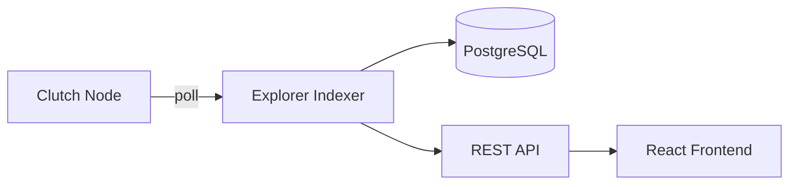

# Clutch Explorer Overview

**Clutch Explorer** is a block explorer for the Clutch Protocol chain. It indexes blocks and transactions from clutch-node into PostgreSQL and serves a REST API plus React frontend.

## Architecture

Unlike the Hub API (GraphQL for app developers), the explorer is read-only infrastructure for browsing chain history.

## Screenshots

:::note
Screenshots are captured from the running explorer frontend. To regenerate, start the stack via [clutch-deploy](/deployment/clutch-deploy) and save the screens to `static/img/`.
:::

## Components

| Component | Description |
|-----------|-------------|
| **Backend** | Rust/Axum REST API + block indexer |
| **Frontend** | React/TypeScript UI |
| **Postgres** | Indexed blocks, transactions, accounts |

## What it indexes

- Blocks and block headers
- All transaction types including ride lifecycle txs
- Account balances, nonces, activity
- Validator set
- Referrer fee metadata

Poll interval defaults to 4000ms (`indexer_poll_interval_ms`).

## When to use

| Tool | Use for |
|------|---------|
| Hub API / SDK | Building ride-sharing apps, submitting txs |
| Explorer | Browsing blocks, debugging txs, account history |

## Documentation

- [Getting Started](/clutch-explorer/getting-started)
- [API Reference](/clutch-explorer/api-reference)

## Deployment

Included in [clutch-deploy](/deployment/clutch-deploy):

| Service | Port |
|---------|------|
| Explorer backend | 8088 |
| Explorer frontend | 5174 |
