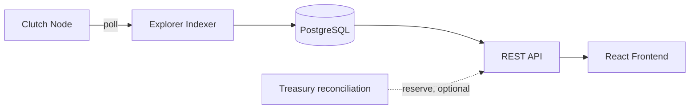

# Clutch Explorer Overview

**Clutch Explorer** is a block explorer for the Clutch Protocol chain. It indexes blocks and transactions from clutch-node into PostgreSQL and serves a REST API plus React frontend.

## Architecture

```mermaid
flowchart LR
    Node["Clutch Node"] -->|"poll"| Indexer["Explorer Indexer"]
    Indexer --> Postgres[("PostgreSQL")]
    Postgres --> Api["REST API"]
    Treasury["Treasury reconciliation"] -.->|"reserve, optional"| Api
    Api --> Ui["React Frontend"]
```

Unlike the Hub API (GraphQL for app developers), the explorer is read-only infrastructure for browsing chain history.

## Screenshots

The home page: the latest figures, a chart of recent chain activity, the reserve behind CLT, and the newest blocks, transactions and validators.

A block, with its producer, its parent and the transactions it carries:

An account in dark mode, with its balance, nonce and every balance change. Dark mode follows the system, and the button in the header overrides it.

These were taken from a local stack, so the network chip reads `LOCAL`. The deployed explorers show `TESTNET` or `MAINNET PILOT`.

## Components

| Component | Description |
|-----------|-------------|
| **Backend** | Rust/Axum REST API + block indexer |
| **Frontend** | React/TypeScript UI |
| **Postgres** | Indexed blocks, transactions, accounts |

## What it indexes

- Blocks and block headers
- All transaction types including ride lifecycle txs
- Account balances, nonces, activity
- Validator set
- Referrer fee metadata

It also republishes the treasury's latest reconciliation, so anyone can see the reserve behind CLT next to the chain ([`GET /api/v1/reserve`](/clutch-explorer/api-reference#reserve)). A deployment with no treasury behind it leaves that section out.

Poll interval defaults to 4000ms (`indexer_poll_interval_ms`).

## When to use

| Tool | Use for |
|------|---------|
| Hub API / SDK | Building ride-sharing apps, submitting txs |
| Explorer | Browsing blocks, debugging txs, account history |

## Documentation

- [Getting Started](/clutch-explorer/getting-started)
- [API Reference](/clutch-explorer/api-reference)

## Deployment

Included in [clutch-deploy](/deployment/clutch-deploy):

| Service | Port |
|---------|------|
| Explorer backend | 8088 |
| Explorer frontend | 5174 |
