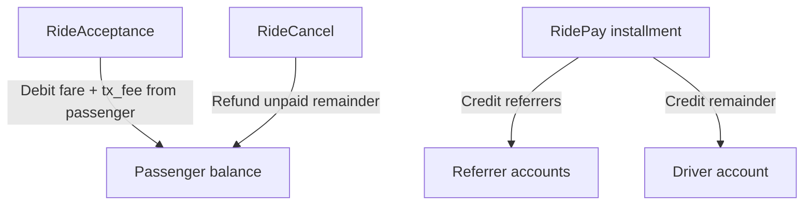

# CLT Economics

CLT (Clutch token) is the native unit on the Clutch blockchain. Clutch's chain is the settlement layer for a **fully-reserved, redeemable token**: every CLT in circulation is backed 1:1 by off-chain reserve. That single design decision drives everything on this page — the peg, the fee model, and why block rewards no longer exist.

## The peg

**1 USD = 1,000,000 CLT.** CLT is an integer micro-dollar — there are **no decimals**; the smallest unit is one micro-dollar. A $5.00 fare is `5 × 1,000,000 = 5,000,000 CLT`. A $0.001 fee is `0.001 × 1,000,000 = 1,000 CLT`.

Because every CLT must be backed 1:1, the chain cannot mint CLT out of nothing without breaking that invariant — which is why block rewards were removed (see below) and why the only two operations that change total supply are `Mint` and `Burn`, both deliberately narrow.

:::warning What the chain can and cannot guarantee
The chain enforces mint authority (only the configured `mint_authority` may mint) and exact supply accounting (`total_supply` moves by exactly the minted or burned amount, once per block). It **cannot** verify that off-chain reserve actually exists to back a mint, or that a burn actually triggers an off-chain payout. Those guarantees are the job of an off-chain reconciliation process and the treasury's operational controls — not consensus. If you are building against this chain, do not treat "the chain accepted my Mint" as proof that the equivalent dollars are held in reserve; that assurance comes from the treasury operator, not the protocol.
:::

## Supply-changing operations: Mint and Burn

These are the **only** two transaction types that change total CLT supply. Everything else (`Transfer`, ride transactions) moves existing CLT between accounts.

### Mint (on-ramp)

`Mint` credits CLT to an address. Only the address recorded as `mint_authority` in genesis may sign one — any other sender is rejected outright. Each `Mint` carries a `credit_ref`: the hash of an off-chain deposit intent (a specific USDT transfer on Tron, verified by the treasury before it ever signs a `Mint` — see [Clutch Treasury](/clutch-treasury/overview)). The chain records that ref permanently, so if the same deposit intent is retried — a verifier re-runs, a worker restarts mid-request — the second `Mint` with the same `credit_ref` is rejected. A deposit can credit CLT exactly once, never twice, no matter how many times the request is retried.

### Burn (redemption)

`Burn` destroys CLT from the caller's own balance. Unlike `Mint`, it is **permissionless** — anyone may burn their own balance, with no authority check. `Burn` carries an **optional** `redemption_ref`: the hash of an off-chain redemption intent, used by an off-chain payout worker to match a confirmed burn to the withdrawal it should trigger. The ref is optional because a burn is a complete, final action on its own — the destruction of CLT does not require a corresponding off-chain payout to be meaningful (a user might simply want to reduce their on-chain holding).

The ordering here is deliberate: **burn first, pay second.** The on-chain leg (destroying CLT) is final the moment it's included in a block. The off-chain leg (wiring dollars back to the user) can fail transiently and be retried against the recorded ref. Reversing that order — paying out before the burn is confirmed — would let a user get paid and then have their burn transaction fail or reorg away, which the fully-reserved model cannot tolerate.

See [Signing and Encoding — Mint](/reference/signing-and-encoding#mint-tag-6) and [Burn](/reference/signing-and-encoding#burn-tag-7) for the exact RLP shapes, and [Transaction Types](/clutch-node/transaction-types) for validation details.

## Validator compensation: flat transaction fee

Block rewards are gone. There is no `block_reward_amount`, and no CLT is minted per block — minting unbacked CLT to pay validators would permanently break the 1:1 reserve invariant this whole model exists to protect.

Instead, every non-exempt transaction pays a flat fee (`tx_fee`, currently **1000 CLT = $0.001**) credited to the author of the block it lands in. This is a straightforward transfer of already-existing, already-backed CLT from sender to block author — it does not touch total supply.

This also gives the chain its first real cost per transaction. Previously, transactions were free; a flat fee means submitting a transaction now costs something, which is what makes spamming the network non-free.

`Mint` and the genesis-only `ChainInit` are fee-exempt (a mint authority crediting a new user should not need CLT of its own to do so). Every other transaction type — including `Burn` — pays the fee. If the sender of a transaction happens to be the block's own author, no fee is charged (there is nothing to transfer to itself).

## Who pays for the network

**A ride pays the protocol nothing.** The driver takes the remainder, the referrers take their basis points, the block author takes the flat `tx_fee`, and those three sum to exactly the fare plus the fee. There is no cut of a fare, no development fund, and no seigniorage — minting is strictly at par, so a deposit creates no surplus for anyone.

That leaves the treasury carrying costs against no income from any of the above. Every sweep of a deposit address into custody and every payout out of the float spends TRX for energy, and a fresh deposit address holds no TRX at all — it has only ever received tokens — so each one has to be funded first, against a 30 TRX preflight floor. Deposits have no minimum, so a deposit worth less than the energy needed to move it is an ordinary case rather than a hypothetical; the sweep threshold, its age escape valve, and the floor underneath that valve exist to keep the treasury from paying to collect it ([Sweeping](/clutch-treasury/reserves-and-reconciliation#sweeping)).

The answer, and the only revenue the protocol itself takes, is a **redemption fee**. It is charged on the payout leg and never on chain: burn *N* CLT, receive *N* minus the fee in USDT, with the difference staying in the reserve. The chain needed no change for it. `Burn` destroys exactly the amount it is handed and knows nothing about the off-chain leg, and reconciliation reads `ok` whenever reserve *covers* liability — so a reserve running ahead of liability is a state it already accepts, not a mismatch.

The fee is quoted once, when the redemption intent is created, and stored on it. It is deliberately **not** recomputed at payout time from configuration: an operator changing the fee between the moment a user is quoted and the moment they are paid would pay out less than the user accepted, and the burn in between cannot be undone. What the user is quoted is what the payout worker later hands to the signer.

That split shows up in the ledger too, and has to. Confirming the burn drops liability by the full *N*; the payout records only the USDT that actually left the float. Recording the gross in both places would understate the reserve by the fee on every redemption — and a reserve reported below liability is the one condition that halts minting.

:::info What the fee actually is
`APP_REDEMPTION_FEE_USDT`, in micro-USDT, per deployment rather than a protocol constant. It defaults to **zero**, so a deployment that never sets it redeems at par. This testnet currently charges **$0.10**.

That figure is bounded by the smallest redemption the deployment allows, not by cost. A fee at or above the minimum makes the smallest redemption a user may request one the treasury then refuses, so it has to sit below that line — and at a $1 minimum, $0.10 is already a tenth of it. It does not cover a payout's Tron energy and is not meant to here, where that energy is faucet TRX. A network holding real value needs a fee measured against real energy cost and a minimum redemption raised to match, decided together rather than scaled from this one.

Fares, referrer splits and the `tx_fee` elsewhere on this page are untouched by any of this. The fee applies only to the redemption leg.
:::

## Ride payment flow

Ride payments are a separate mechanism layered on top of ordinary CLT transfers — referrer fees on each `RidePay`, with the driver receiving the remainder.

### Step 1: RideAcceptance

When a passenger accepts an offer, the full offer fare **plus the flat transaction fee** is debited from the passenger. No funds are credited to the driver yet.

### Step 2: RidePay

Each `RidePay` transaction distributes that payment installment:

- **Request referrer** — `floor(ride_request_referrer_fee_bps × amount / 10_000)` (default **200 bps = 2%**)
- **Offer referrer** — `floor(ride_offer_referrer_fee_bps × amount / 10_000)` (default **200 bps = 2%**)
- **Driver** — installment amount minus total referrer fees (the exact remainder)

The passenger is not debited again on `RidePay`; payment comes from the fare already reserved at acceptance. `RidePay` itself also pays the flat `tx_fee` to the block author, from the passenger's balance.

Referrer fees use **floor rounding**, and the three shares (request referrer + offer referrer + driver) always sum to exactly the fare — no rounding remainder is lost or invented.

:::info Why floor rounding replaced ceiling rounding
The old model used ceiling rounding on a percent-based fee: 2% of a 3-unit fare rounded *up* to 1 whole unit, which is 33% of the fare — a wildly wrong result that only existed because the old CLT had no small denomination to express "2% of 3" precisely. Now that CLT is a micro-dollar, fees are basis points with floor rounding, so a fee that rounds to zero on a tiny fare simply *is* zero, rather than being inflated to the smallest nonzero unit. The driver's share is always defined as the remainder, so the three shares still add up to the fare exactly, for every input.
:::

### Step 3: RideCancel

If a trip is cancelled before the full fare is paid, the unpaid remainder is refunded to the passenger. If the passenger initiates the cancellation, the flat `tx_fee` is also deducted from that refund; if the driver initiates it, the driver pays the fee separately and the passenger's refund is untouched.

### Example

Default config, a **$5.00** fare (`5 × 1,000,000 = 5,000,000 CLT`), one full `RidePay`, both referrers set:

| Recipient | CLT | USD |
|-----------|-----|-----|
| Request referrer | `floor(5,000,000 × 200 / 10,000)` = 100,000 | $0.10 |
| Offer referrer | `floor(5,000,000 × 200 / 10,000)` = 100,000 | $0.10 |
| Driver | 4,800,000 | $4.80 |

With no referrers, the driver receives the full installment.

## Referrer addresses

Referrer addresses are attached to `RideRequest` and `RideOffer` at creation time. The Hub API injects defaults from config when the client does not supply a referrer:

- `default_ride_request_referrer`
- `default_ride_offer_referrer`

See [Hub API configuration](/clutch-hub-api/configuration).

## Node configuration keys

| Setting | Description | This testnet's value |
|---------|-------------|---------|
| `chain_id` | Network identifier, signed into every transaction | `2077` |
| `is_testnet` | Gates the genesis faucet allocation; a non-testnet chain configured with a nonzero allocation refuses to boot | `true` |
| `tx_fee` | Flat CLT fee per non-exempt transaction, paid to the block author | `1000` (= $0.001) |
| `mint_authority` | The only address permitted to sign `Mint` | testnet dev key |
| `faucet_address` / `faucet_allocation` | A genesis account and its starting balance. Zero here, so the account is inert (see below) | `0` |
| `ride_request_referrer_fee_bps` | Request-side referrer fee on each `RidePay`, in basis points | `200` (2%) |
| `ride_offer_referrer_fee_bps` | Offer-side referrer fee on each `RidePay`, in basis points | `200` (2%) |

All of these are committed into state at genesis by the `ChainInit` transaction (tag 9) and must be **identical across every node** — see [Node Configuration](/clutch-node/configuration) for why a mismatch prevents peers from connecting at all, rather than silently forking.

## Testnet notes

- **Genesis pre-mints nothing.** `faucet_allocation` is `0`, so total supply at block 0 is zero and every CLT that exists was minted against a deposit. The chain would still honour a nonzero allocation when `is_testnet = true`, and forces it to zero otherwise — a genesis pre-mint surviving onto a real network would destroy the peg immediately, since that CLT would exist with no reserve behind it.
- **Why it went to zero, on a testnet where the CLT was play money anyway.** The faucet endpoint was removed long before the balance was. That was the wrong half. The endpoint *transferred* rather than minted, so what it handed out had no USDT behind it and was excluded from reserve liability by construction — harmless while CLT only ever flowed one way. Once redemptions went live, and with nothing in the burn path asking where burned CLT came from, the account became a route from unbacked supply to real USDT out of the payout float, gated by nothing but whoever held its key. The allocation went to zero on 2026-09-05, which required a chain reset because genesis values are committed into the genesis hash.
- `faucet_address` stays in config, and stays a consensus parameter every node must agree on, because removing the field would change the `ChainInit` encoding. With a zero allocation it names an account that is credited nothing and holds nothing. CLT is obtained by [depositing USDT](/clutch-treasury/deposits).
- Balances are `u64`, deltas `i64` — supply is kept within `i64::MAX` by a boot-time check on `faucet_allocation` and a runtime check after every `Mint`/`Burn`.
- **The peg is an accounting rule here, not a claim on dollars.** CLT on this testnet is genuinely backed 1:1 — but by *Nile testnet* USDT, a token a public faucet gives away and which has no fiat value of its own. Everything mechanical on this page is real and enforced: a $5.00 fare is exactly 5,000,000 CLT, every mint is gated on reserve covering liability, and reconciliation really does halt minting on a shortfall. What is not real is the money at the bottom of the stack. Read a dollar figure anywhere in these docs as a unit of account rather than a redeemable dollar. Nothing about the mechanism changes when real USDT replaces testnet USDT; only the value behind it does.

## Related

- [App Developer Incentives](/getting-started/app-developer-incentives) — Earn CLT as an app builder via referrer fees
- [Transaction Types](/clutch-node/transaction-types) — Mint, Burn, ChainInit, and referrer fees
- [Signing and Encoding](/reference/signing-and-encoding) — RLP shapes for Mint/Burn/ChainInit
- [Ride Lifecycle](/getting-started/ride-lifecycle)
- [Node Configuration](/clutch-node/configuration)
