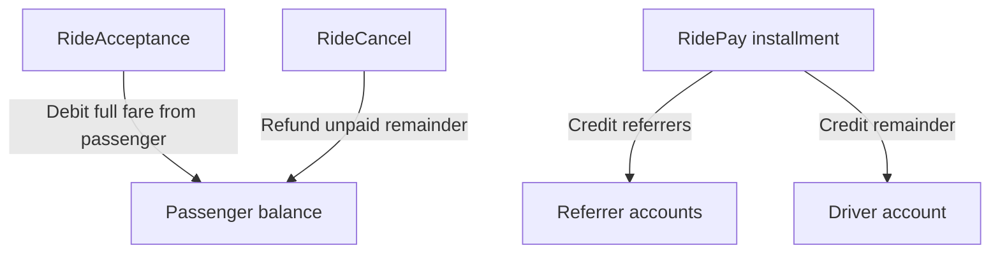

# CLT Economics

CLT (Clutch token) is the native unit on the Clutch blockchain. Ride payments and validator rewards follow the rules below — all enforced in `clutch-node`.

## Overview

Two separate mechanisms:

| Layer | Mechanism | Default |
|-------|-----------|---------|
| **Ride payments** | Referrer fees on each `RidePay`, driver gets the remainder | 2% request + 2% offer |
| **Network** | Fixed block reward minted to the block author | 50 CLT per block |

Ride fares do **not** fund validators directly. Validators earn block rewards only.

## Ride payment flow



### Step 1: RideAcceptance

When a passenger accepts an offer, the full offer fare is debited from the passenger (`RideAcceptanceDebit`). No funds are credited to the driver yet.

### Step 2: RidePay

Each `RidePay` transaction distributes that payment installment:

- **Request referrer** — `ceil(ride_request_referrer_fee_percent × amount / 100)` (default **2%**)
- **Offer referrer** — `ceil(ride_offer_referrer_fee_percent × amount / 100)` (default **2%**)
- **Driver** — installment amount minus total referrer fees

The passenger is not debited again on `RidePay`; payment comes from the fare already reserved at acceptance.

Referrer fees use **ceiling rounding** (e.g. 2% of 3 CLT = 1 CLT).

If the same address is referrer on both request and offer, both fees are credited to that address (up to 4% of the installment when defaults apply).

### Step 3: RideCancel

If a trip is cancelled before the full fare is paid, the unpaid remainder is refunded to the passenger.

### Example

Default config, **10 CLT** fare, one full `RidePay`, both referrers set:

| Recipient | CLT |
|-----------|-----|
| Request referrer | 1 |
| Offer referrer | 1 |
| Driver | 8 |

With no referrers, the driver receives the full installment.

## Referrer addresses

Referrer addresses are attached to `RideRequest` and `RideOffer` at creation time. The Hub API injects defaults from config when the client does not supply a referrer:

- `default_ride_request_referrer`
- `default_ride_offer_referrer`

See [Hub API configuration](/clutch-hub-api/configuration).

## Validator block reward

Configured per node:

```toml
block_reward_amount = 50
```

- Minted to the block author on every **non-genesis** block
- Independent of ride volume and fare amounts

## Configuration keys

| Setting | Description | Default |
|---------|-------------|---------|
| `ride_request_referrer_fee_percent` | Request-side referrer fee on each `RidePay` | `2` |
| `ride_offer_referrer_fee_percent` | Offer-side referrer fee on each `RidePay` | `2` |
| `block_reward_amount` | CLT minted to block author per block | `50` |

## Alpha / testnet notes

- Genesis allocates test supply to the faucet account (`i64::MAX` CLT, ~9.2 × 10^18) for development — balance deltas travel as `i64`, so the allocation stays inside that range
- There is no on-chain supply cap or emission schedule beyond `block_reward_amount`
- CLT has no fixed fiat peg; fares are denominated in CLT

## Related

- [App Developer Incentives](/getting-started/app-developer-incentives) — Earn CLT as an app builder via referrer fees
- [Transaction Types — Referrer fees](/clutch-node/transaction-types#referrer-fees)
- [Ride Lifecycle](/getting-started/ride-lifecycle)
- [Node Configuration](/clutch-node/configuration)
