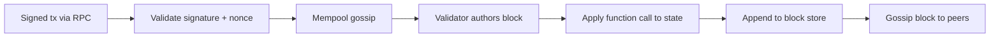

# Clutch Node Overview

Clutch Node is the blockchain core of Clutch Protocol. It runs the consensus layer, stores blocks and state, validates transactions, and exposes WebSocket JSON-RPC and Prometheus metrics endpoints.

## Features

- **Aura consensus** — Round-robin block production and finality across configured validators
- **Custom transaction format** — Non-EVM, RLP-encoded function calls tailored for ride-sharing
- **Metrics** — Prometheus-compatible `/metrics` on ports 3001–3003
- **Multi-node** — Bootstrap and peer discovery via libp2p
- **Decentralized** — Eliminates intermediaries, direct user-to-user
- **Secure** — Blockchain-verified transactions with on-chain auditability

## Components

| Component | Responsibility |
|-----------|----------------|
| **Consensus** | Aura round-robin scheduling; only addresses in `authorities` may author blocks |
| **Mempool** | Accepts and gossips pending transactions; rejects invalid nonces/signatures |
| **State** | Account balances, nonces, and the ride state machine (requests, offers, trips) |
| **Transaction processor** | Applies function-call tags (Transfer, RideRequest, RidePay, …) to state |
| **Block store** | Append-only block ledger; genesis allocates the testnet faucet supply |
| **RPC server** | WebSocket JSON-RPC for apps and the Hub API |
| **P2P layer** | libp2p gossip for tx and block propagation, plus bootstrap peer discovery |
| **Metrics exporter** | Exposes node state, block index, and runtime counters to Prometheus |

## Transaction lifecycle in the node

Apps do not call the node RPC directly in most cases — they go through the [Hub API](/clutch-hub-api/overview), which builds unsigned transactions and forwards signed ones.

## Ports (per node)

| Port | Purpose |
|------|---------|
| 8081/8082/8083 | WebSocket JSON-RPC (node1/node2/node3) |
| 4001/4002/4003 | libp2p |
| 3001/3002/3003 | Prometheus metrics |

## Status and limitations

- **Alpha testnet only** — no mainnet, small validator set on the public testnet
- `ConfirmArrival` and `ComplainArrival` exist as stubs (see [Transaction Types](/clutch-node/transaction-types))
- DAO / governance is on the roadmap and not yet implemented

## Source

[clutch-node](https://github.com/clutchprotocol/clutch-node) on GitHub.

## Related

- [Node Configuration](/clutch-node/configuration)
- [Running Clutch Node](/clutch-node/running)
- [Transaction Types](/clutch-node/transaction-types)
- [CLT Economics](/clutch-node/clt-economics)
- [Architecture](/getting-started/architecture)
