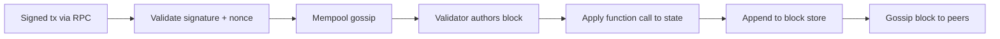

# Clutch Node Overview

Clutch Node is the blockchain core of Clutch Protocol. It runs the consensus layer, stores blocks and state, validates transactions, and exposes WebSocket JSON-RPC and Prometheus metrics endpoints.

## Features

- **Aura consensus** — Round-robin block production and finality across configured validators
- **Custom transaction format** — Non-EVM, RLP-encoded function calls tailored for ride-sharing
- **Metrics** — Prometheus-compatible `/metrics` on ports 3001–3003
- **Multi-node** — Bootstrap and peer discovery via libp2p
- **Decentralized** — Eliminates intermediaries, direct user-to-user
- **Secure** — Blockchain-verified transactions with on-chain auditability

## Components

| Component | Responsibility |
|-----------|----------------|
| **Consensus** | Aura round-robin scheduling; only addresses in `authorities` may author blocks |
| **Mempool** | Accepts and gossips pending transactions; rejects invalid nonces/signatures |
| **State** | Account balances, nonces, and the ride state machine (requests, offers, trips) |
| **Transaction processor** | Applies function-call tags (Transfer, RideRequest, RidePay, …) to state |
| **Block store** | Append-only block ledger; genesis pre-mints nothing, so supply starts at zero |
| **RPC server** | WebSocket JSON-RPC for apps and the Hub API |
| **P2P layer** | libp2p gossip for tx and block propagation, plus bootstrap peer discovery |
| **Metrics exporter** | Exposes node state, block index, and runtime counters to Prometheus |

## Transaction lifecycle in the node

```mermaid
flowchart LR
    Tx["Signed tx via RPC"] --> Validate["Validate signature + nonce"]
    Validate --> Mempool["Mempool gossip"]
    Mempool --> Author["Validator authors block"]
    Author --> Apply["Apply function call to state"]
    Apply --> Store["Append to block store"]
    Store --> Gossip["Gossip block to peers"]
```

Apps do not call the node RPC directly in most cases — they go through the [Hub API](/clutch-hub-api/overview), which builds unsigned transactions and forwards signed ones.

"Validate signature" accepts three signatures, each against its own digest: a key's signature over the transaction hash string, a wallet's `personal_sign` signature over `clutch-tx:{chain_id}:{hash}` (MetaMask and Trust Wallet will not sign a bare hash), and TronLink's `signMessageV2` signature over the same text (a TRON account is the same kind of key, with another prefix). See [Signing and Encoding](/reference/signing-and-encoding#signature-algorithm). The second and the third are consensus rules: a validator that does not have one rejects a block that carries a transaction signed that way, so every validator must run a build that has it.

## Ports (per node)

| Port | Purpose |
|------|---------|
| 8081/8082/8083 | WebSocket JSON-RPC (node1/node2/node3) |
| 4001/4002/4003 | libp2p |
| 3001/3002/3003 | Prometheus metrics |

## Status and limitations

- **Alpha** — the mainnet (chain `1000`) is live as a capped pilot, and the public testnet (chain `2077`) runs beside it. Both have a small validator set: three authorities each, all running on a single host. See [Environments](/getting-started/environments) and [Mainnet Readiness](/reference/mainnet-readiness)
- Progressive `RidePay` releases after `RideAcceptance`; the chain does not attest physical arrival
- DAO / governance is on the roadmap and not yet implemented

## Source

[clutch-node](https://github.com/clutchprotocol/clutch-node) on GitHub.

## Related

- [Node Configuration](/clutch-node/configuration)
- [Running Clutch Node](/clutch-node/running)
- [Transaction Types](/clutch-node/transaction-types)
- [CLT Economics](/clutch-node/clt-economics)
- [Architecture](/getting-started/architecture)
