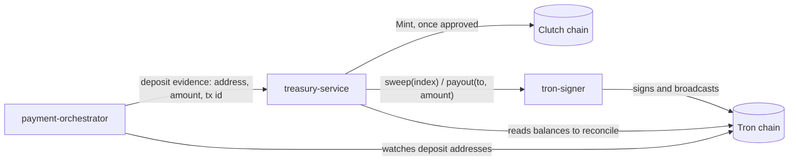

# Clutch Treasury Overview

CLT is a **fully-reserved, redeemable token**: every CLT in circulation is supposed to be backed 1:1 by USDT held off-chain. The chain half of that promise is enforced by consensus — only the configured `mint_authority` may sign a `Mint`, and total supply moves by exactly the minted or burned amount ([CLT Economics](/clutch-node/clt-economics)). The chain **cannot** verify that the reserve backing a given mint actually exists. It has no way to look at a Tron balance. That verification, and everything that depends on it, is the treasury's job.

"The treasury" is three separate services, deliberately split so that no single one of them can both **decide** to create CLT and **move** the money that is supposed to back it.

## The three services

| Service | Holds | Can do | Cannot do |
|---------|-------|--------|-----------|
| `payment-orchestrator` | The account **xpub** only — public material that derives Tron addresses but cannot sign for them | Derive and watch per-user deposit addresses; credit confirmed transfers into its own database; ask the treasury to mint | Sign a Tron transaction; move a single unit of USDT anywhere |
| `treasury-service` | The Clutch chain's `mint_authority` key — a signing key for the **Clutch chain**, unrelated to any Tron key | Approve or deny a mint (four-eyes, caps, the breaker); sign and submit `Mint` transactions on the Clutch chain; read Tron balances to compute the reserve; *ask* `tron-signer` to sweep or pay out | Sign anything on Tron; move USDT except by asking `tron-signer`, which can refuse |
| `tron-signer` | The deposit mnemonic — the only copy of it in the system | Derive every Tron key the stack uses (deposit addresses, the fee account, the payout float); sign and broadcast a sweep or a payout | Be told a sweep *destination* (sweep takes an index only); pay out more than the float holds or its per-transaction cap allows |

`payment-orchestrator` is the one with a public HTTP surface, reachable from a browser and driven by whatever a user's request happens to say. That is exactly why it is the one holding no spending key at all: deriving a receive address from an xpub is a one-way operation, so even a fully compromised orchestrator cannot construct a transaction that moves anything. It can only watch, and ask.

`treasury-service` sits behind that: it decides *whether* a mint or a payout should happen — four-eyes approval, a per-transaction cap, a rolling daily cap, a backing-ratio check, and a breaker that halts everything on the first sign of a mismatch (see [Reserves and Reconciliation](/clutch-treasury/reserves-and-reconciliation)). But deciding is not the same as doing: every Tron-moving action it wants is a request to `tron-signer`, not a transaction it can build itself.

`tron-signer` holds the one key that matters and exposes the narrowest possible surface for using it: a sweep endpoint that takes an index and nothing else (the destination is baked into its own config, so no caller can redirect it), and a payout endpoint that takes a destination and an amount but can only ever spend from a small, separately-derived float — never custody, never a deposit address. It has no published port in the deployed stack; nothing reaches it except the two services above.

:::warning What "cannot spend" means precisely
`payment-orchestrator` cannot spend because it never has a private key — not because of a permission check that could be misconfigured. `treasury-service` cannot spend Tron funds directly for the same structural reason; its own key only ever signs a *Clutch*-chain `Mint`, a different chain entirely. The only thing standing between a compromised `treasury-service` and the payout float is `tron-signer`'s own per-transaction cap and the float's balance — see [Redemptions](/clutch-treasury/redemptions) for why that bound, not a permission system, is the actual security argument.
:::

## How the pieces fit together

Two independent things read Tron: the orchestrator watches deposit addresses to detect incoming payments, and the treasury separately reads balances to compute the reserve during reconciliation. Both are read-only. The only arrows that write to Tron pass through `tron-signer`.

## Testnet posture

:::danger Not production custody
This is a testnet system. The mint authority and the deposit mnemonic are both environment variables today, not keys behind a KMS or a hardware boundary. `clutch-treasury/docs/keys.md` names the mainnet blocker explicitly: an AWS-KMS-backed signer, a real key ceremony, and tested recovery, all before any of this holds real funds. `ChainSigner` (the mint key) and `PayoutSigner` (the payout key) are both already written as swap boundaries for that future signer — the seam exists, but nothing on the other side of it does yet.
:::

## Related

- [Deposits](/clutch-treasury/deposits) — how USDT becomes CLT
- [Reserves and Reconciliation](/clutch-treasury/reserves-and-reconciliation) — how the peg is kept honest
- [Redemptions](/clutch-treasury/redemptions) — how CLT becomes USDT again
- [Operating the Treasury](/clutch-treasury/operations) — the workflows an operator actually runs
- [Treasury Stack](/deployment/treasury-stack) — how to bring these three services up
- [CLT Economics](/clutch-node/clt-economics) — what the chain itself guarantees around Mint and Burn
- [Security](/reference/security) — key management across the whole stack
