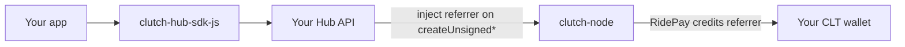

# App Developer Incentives

Build a ride-sharing app on Clutch and earn CLT when users complete rides on your deployment. The network pays **referrer fees** on each `RidePay` — there is no separate grants program or development treasury.

## How app builders earn

When a passenger pays a driver via `RidePay`, the node splits each payment installment:

| Recipient | Share (default) | Source |
|-----------|-----------------|--------|
| Request referrer | 200 bps (2%) of installment | `RideRequest.referrer` |
| Offer referrer | 200 bps (2%) of installment | `RideOffer.referrer` |
| Driver | Remainder | Fare minus referrer fees |

Fees are credited in **CLT** on-chain — CLT is a micro-dollar (1 USD = 1,000,000 CLT), so a "2% referrer fee" on a $5.00 fare is 100,000 CLT ($0.10), not 2 whole CLT. If the same wallet is referrer on both request and offer, it can receive up to **400 bps (4%)** of each `RidePay` installment (with default node config).

Referrer fees are configured in **basis points** and use **floor rounding**: `floor(fare × bps / 10_000)`. The driver's share is always the exact remainder, so the three shares (request referrer + offer referrer + driver) sum to the fare precisely, for every fare.

## When you get paid

Referrer fees are paid **only on `RidePay`**, not when a ride is requested or accepted.

1. Passenger accepts an offer → full fare is debited from the passenger (`RideAcceptance`).
2. Passenger sends one or more `RidePay` transactions → referrers and driver are credited from that installment.
3. If the trip is cancelled before full payment, unpaid fare is refunded to the passenger — no referrer fee on amounts never paid.

Your earnings scale with **ride volume and fares** on transactions where your wallet is the referrer.

## Earnings example

Default config, a **$5.00** fare (`5 × 1,000,000 = 5,000,000 CLT`), one full `RidePay`, both referrers set to your app wallet:

| Recipient | CLT | USD |
|-----------|-----|-----|
| Your wallet (request referrer) | 100,000 | $0.10 |
| Your wallet (offer referrer) | 100,000 | $0.10 |
| Driver | 4,800,000 | $4.80 |

If you set the same address for both `default_ride_request_referrer` and `default_ride_offer_referrer`, you receive **200,000 CLT ($0.20)** on this ride.

With **no** referrers configured, the driver receives the full installment and app builders earn nothing from that ride.

## How to participate



### 1. Run your own Hub API

Referrer addresses are attached when the Hub API builds unsigned `RideRequest` and `RideOffer` transactions. Clients do not choose the referrer on the public Hub — it comes from **your** Hub config.

Set your CLT wallet in Hub API config:

```toml
# App-developer referrers injected by Hub API
default_ride_request_referrer = "0xYourClutchPublicKey"
default_ride_offer_referrer = "0xYourClutchPublicKey"
```

Use the same address on both sides to earn both fee streams, or use different addresses for request vs offer attribution.

See [Hub API configuration](/clutch-hub-api/configuration).

### 2. Build your app with the SDK

Integrate [`clutch-hub-sdk-js`](https://www.npmjs.com/package/clutch-hub-sdk-js) for signing and GraphQL calls. Point the SDK at **your** Hub API URL, not only the public stage/demo Hub.

### 3. Deploy the stack

Use [clutch-deploy](/deployment/clutch-deploy) to run nodes, your Hub API, and your app (Docker Compose). All rides through your Hub carry your referrer addresses.

### 4. Track earnings

Use [Clutch Explorer](/clutch-explorer/overview) or node RPC `get_account_balance_effects` to audit `ReferrerRequestFee` and `ReferrerOfferFee` credits to your wallet.

## What you need

| Requirement | Purpose |
|-------------|---------|
| CLT wallet (secp256k1 key pair) | Receive referrer payouts |
| Hub API deployment | Inject your referrer on ride txs |
| App (web/mobile) + SDK | User-facing ride flows |
| Connection to Clutch nodes | Submit signed transactions |

## Important limits

:::warning Alpha / testnet
Clutch is experimental, and APIs and economics may change. The CLT figures above are exact — 2% of a $5.00 fare really is 100,000 CLT — but on this testnet CLT is backed by Nile *testnet* USDT, which has no fiat value. The peg is an accounting rule you can build against, not money you can spend yet ([Testnet notes](/clutch-node/clt-economics#testnet-notes)).
:::

- **Your Hub, your referrers** — Earnings go to whoever owns the Hub config. Apps using someone else's shared Hub do not automatically get a share unless that operator sets your wallet as referrer.
- **No per-app registry** — There is no on-chain app ID or automatic revenue split across multiple third-party apps on one Hub today.
- **No grants or dev fund** — Referrer fees on rides are the only built-in app-builder revenue mechanism.
- **Validators are separate** — Validators are compensated from the flat `tx_fee` paid by every non-exempt transaction, not from referrer fees or ride fares. There are no block rewards anymore; see [CLT Economics](/clutch-node/clt-economics#validator-compensation-flat-transaction-fee).

## Node-side fee rates

Referrer **rates** are set on each node, as basis points (must match across validators — see [why](/clutch-node/configuration#consensus-parameters-must-match-across-every-node)):

```toml
ride_request_referrer_fee_bps = 200
ride_offer_referrer_fee_bps = 200
```

See [Node configuration](/clutch-node/configuration) and [CLT Economics](/clutch-node/clt-economics).

## Next steps

- [Quick Start](/getting-started/quickstart) — Run the stack locally
- [Ride Lifecycle](/getting-started/ride-lifecycle) — Passenger/driver transaction tutorial
- [Hub API configuration](/clutch-hub-api/configuration) — Referrer settings
- [CLT Economics](/clutch-node/clt-economics) — Full payment and block-reward model
- [SDK overview](/clutch-hub-sdk-js/overview) — Integrate your app
