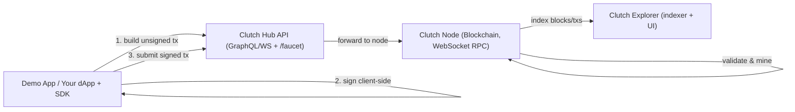

# Architecture

## High-Level Flow

### Transaction steps

1. **Build unsigned tx** — the app asks the Hub API for an unsigned transaction payload
2. **Sign client-side** — the user signs the hash locally with their private key (keys never sent to server)
3. **Submit signed tx** — the app sends the signed RLP hex to the Hub, which forwards it to the node
4. **Validate & mine** — the node verifies signature/nonce, applies it to state, and includes it in a block

## Component Roles

### Clutch Node

- **Consensus**: Aura round-robin over configured validators
- **Transaction format**: Custom RLP-encoded function calls (non-EVM)
- **Exposes**: WebSocket JSON-RPC (8081–8083), libp2p (4001–4003), Prometheus (3001–3003)
- **Responsibilities**: Block production, transaction validation, ride state machine

### Clutch Hub API

- **Role**: Bridge between applications and the node
- **Exposes**: GraphQL at `/graphql`, subscriptions at `/graphql/ws`, faucet at `/faucet`, health at `/health`
- **Responsibilities**: Build unsigned transactions, submit signed transactions, wallet JWT auth, poll-based subscriptions

### Clutch Hub SDK

- **Role**: Client-side signing and API integration
- **Responsibilities**: RLP encoding, Keccak-256 hashing, secp256k1 signing, GraphQL queries/subscriptions

### Clutch Explorer

- **Role**: Read-only chain indexer and block explorer
- **Exposes**: REST API (8088), React UI (5174)
- **Responsibilities**: Index blocks/transactions into Postgres, serve search and account history

## Security Model

- **Client-side signing**: Private keys never leave the user's device
- **Wallet JWT**: Public key identity — no username/password
- **Nonce**: Prevents replay attacks per account
- **On-chain auditability**: All transactions recorded on the blockchain

## Real-time data

Apps receive live updates via GraphQL subscriptions. The API polls the node and pushes snapshots (~1s for trips, ~0.5s for offers). The SDK multiplexes subscriptions over a shared WebSocket.

## Related

- [Ride Lifecycle](/getting-started/ride-lifecycle)
- [Transaction Flow](/reference/transaction-flow)
- [Environments](/getting-started/environments)
