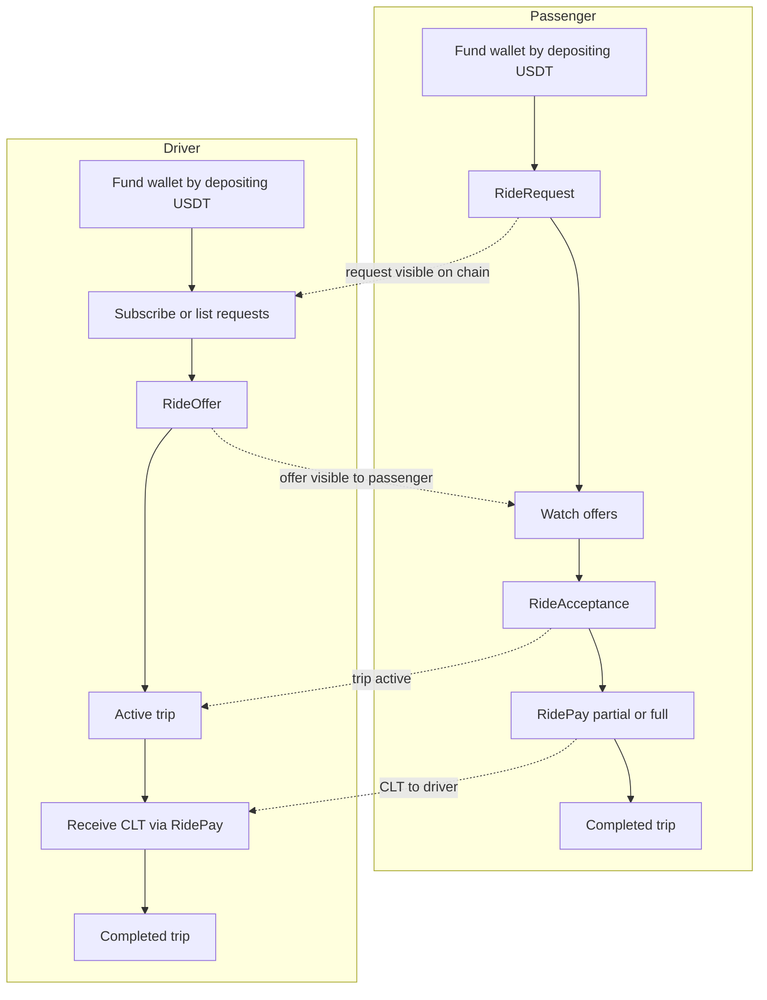
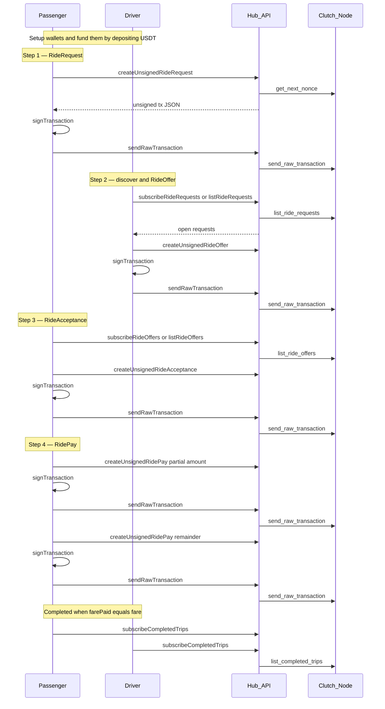
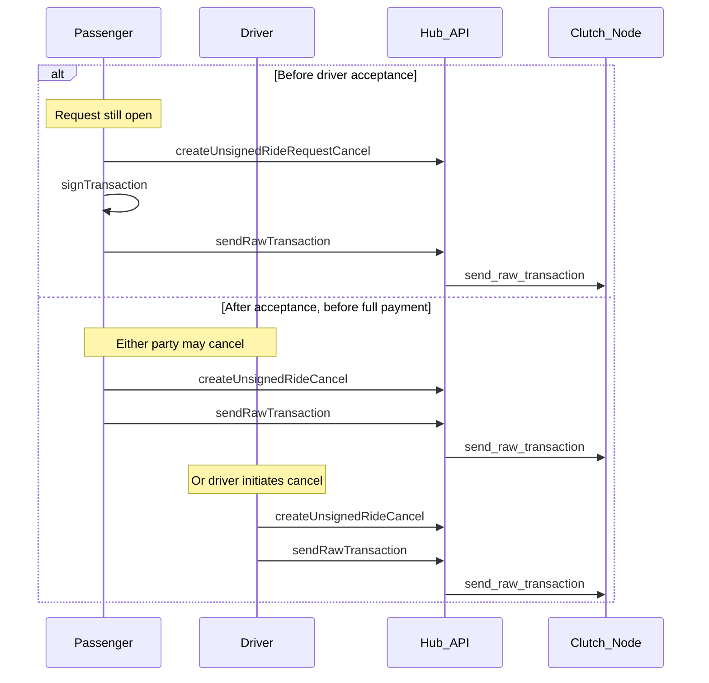
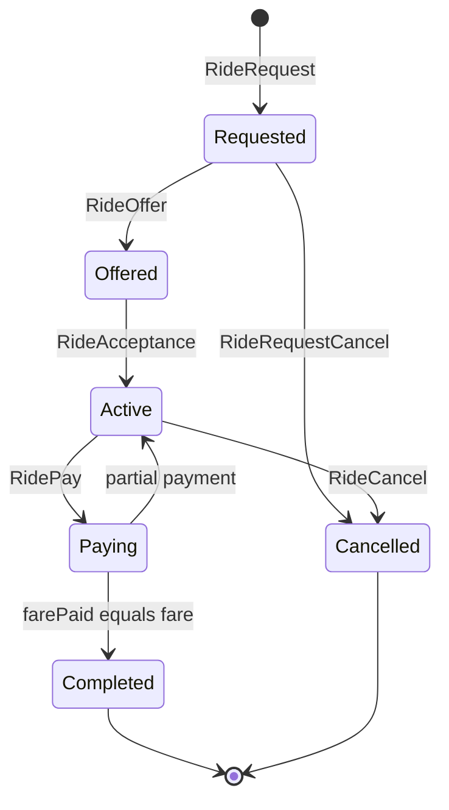

# Ride Lifecycle

This guide walks through the complete ride-sharing flow using the Clutch Hub SDK — from wallet setup to payment.

## Complete passenger–driver flow {#complete-passengerdriver-flow}

Overview of how **passenger** and **driver** apps interact through the Hub API and node. Every write follows: `createUnsigned*` → sign client-side → `sendRawTransaction`.

### Swimlane overview



### Sequence diagram (happy path)



### Cancellation branches



| When | Who | Transaction | Condition |
|------|-----|-------------|-----------|
| Before acceptance | Passenger only | `RideRequestCancel` | No driver accepted yet |
| After acceptance | Passenger or driver | `RideCancel` | `farePaid` less than `fare` |

### Who the unpaid remainder goes to

By default a `RideCancel` refunds the unpaid remainder to the passenger. That is the right answer
while a ride is genuinely being called off, and the wrong one once the ride has happened: a rider
who takes the trip and simply never pays the rest can cancel and take the money back. Partial
payment protects the rider; nothing protected the driver.

A chain may therefore set an **auto-release window**. Past it, the remainder belongs to the driver
instead, whoever submits the cancel — including the rider, for whom cancelling late no longer
helps. If the driver's address cannot be read the refund happens anyway, because paying out to an
address the node cannot verify would be guessing.

The window is `ride_auto_release_secs`, a **genesis-committed consensus parameter** in `ChainInit` —
it decides who receives money, so a node with a different value computes a different balance from
the same block, and it cannot be added to a chain after genesis. It defaults to `0`, which disables
the rule entirely.

:::note The public testnet uses five minutes, mainnet will use two hours
Stage runs `ride_auto_release_secs = 300`, enabled by a chain reset on 2026-09-14. That is
deliberately short: two hours cannot be exercised on a development chain, so the rule would reach
mainnet having never run against a real ride. The decision of record for mainnet is **7200** (two
hours), and `check-genesis.sh` refuses any other value when building a mainnet genesis.

Read the live value rather than trusting this page — it is in `get_chain_info`:

```json
{ "chain_id": 2077, "ride_auto_release_secs": 300, "latest_block_index": 39 }
```
:::

Code examples for cancellation are in [Cancellation](#cancellation) below.

## Prerequisites

- Clutch stack running locally ([Quick Start](/getting-started/quickstart)) or use [Stage environment](/getting-started/environments)
- Two wallets: one passenger, one driver
- CLT in both wallets — fund each one by [depositing USDT](/clutch-treasury/deposits)

## 1. Setup wallets and SDK

```javascript
import { ClutchHubSdk } from 'clutch-hub-sdk-js';

const API_URL = 'http://localhost:3000';
const CHAIN_ID = 2077; // from your own app config, never from the hub

const passengerKey = '0x...'; // passenger public key
const driverKey = '0x...';    // driver public key
const passengerPrivateKey = '...'; // keep secret
const driverPrivateKey = '...';

const passengerSdk = new ClutchHubSdk(API_URL, passengerKey, undefined, CHAIN_ID);
const driverSdk = new ClutchHubSdk(API_URL, driverKey, undefined, CHAIN_ID);
```

## 2. Fund wallets

Both wallets need CLT before they can transact, and CLT is issued against a USDT deposit. Each wallet has one permanent Tron address; USDT (TRC-20) sent to it is minted as CLT to that wallet. Get the address from `POST /api/v1/deposits` on `payment-orchestrator`, or from the demo app's ☰ → **Top up with USDT** panel — see [Deposits](/clutch-treasury/deposits).

Confirm the CLT arrived before going on:

```javascript
const balance = await passengerSdk.getAccountBalance(); // bigint
console.log('Passenger balance:', formatUsd(balance));
```

## 3. Passenger creates a ride request

```javascript
async function submitTx(sdk, unsigned, privateKey) {
  const signed = await sdk.signTransaction(unsigned, privateKey);
  await sdk.submitTransaction(signed.rawTransaction);
  return signed.txHash;
}

const FARE = 5_000_000n; // $5.00 at 1 USD = 1,000,000 CLT

const requestTx = await submitTx(
  passengerSdk,
  await passengerSdk.createUnsignedRideRequest({
    pickup: { latitude: 35.6892, longitude: 51.3890 },
    dropoff: { latitude: 35.7219, longitude: 51.3347 },
    fare: FARE,
  }),
  passengerPrivateKey
);

console.log('Ride request tx:', requestTx);
```

## 4. Driver finds requests and submits an offer

```javascript
// Poll or subscribe
const requests = await driverSdk.listRideRequests();
console.log('Open requests:', requests);

const offerTx = await submitTx(
  driverSdk,
  await driverSdk.createUnsignedRideOffer({
    rideRequestTxHash: requestTx,
    fare: FARE,
  }),
  driverPrivateKey
);

console.log('Ride offer tx:', offerTx);
```

Real-time alternative:

```javascript
driverSdk.subscribeRideRequests(null, {
  onData: (requests) => console.log('Updated requests:', requests),
});
```

## 5. Passenger accepts the offer

```javascript
const offers = await passengerSdk.listRideOffers(requestTx);
const acceptanceTx = await submitTx(
  passengerSdk,
  await passengerSdk.createUnsignedRideAcceptance({
    rideOfferTxHash: offers[0].txHash,
  }),
  passengerPrivateKey
);

console.log('Acceptance tx:', acceptanceTx);
```

## 6. Passenger pays the driver

Partial payments are allowed until `farePaid` equals `fare`:

```javascript
await submitTx(
  passengerSdk,
  await passengerSdk.createUnsignedRidePay({
    rideAcceptanceTxHash: acceptanceTx,
    fare: 2_500_000n, // first partial payment ($2.50)
  }),
  passengerPrivateKey
);

await submitTx(
  passengerSdk,
  await passengerSdk.createUnsignedRidePay({
    rideAcceptanceTxHash: acceptanceTx,
    fare: 2_500_000n, // completes payment
  }),
  passengerPrivateKey
);
```

## 7. Monitor active trips

```javascript
passengerSdk.subscribeActiveTrips(
  { passengerAddress: passengerKey },
  {
    onData: (trips) => {
      trips.forEach((t) => {
        console.log(`Trip ${t.txHash}: paid ${formatUsd(t.farePaid)}/${formatUsd(t.fare)}`);
      });
    },
  }
);
```

When `farePaid === fare`, the trip moves to completed lists.

## Cancellation

**Cancel pending request** (passenger only, before acceptance):

```javascript
await submitTx(
  passengerSdk,
  await passengerSdk.createUnsignedRideRequestCancel({
    rideRequestTxHash: requestTx,
  }),
  passengerPrivateKey
);
```

**Cancel active trip** (either party, before full payment):

```javascript
await submitTx(
  passengerSdk,
  await passengerSdk.createUnsignedRideCancel({
    rideAcceptanceTxHash: acceptanceTx,
  }),
  passengerPrivateKey
);
```

## GraphQL equivalent

Each SDK method maps to a GraphQL mutation. Example for ride request:

```graphql
mutation CreateUnsignedRideRequest(
  $pickupLatitude: Float!, $pickupLongitude: Float!,
  $dropoffLatitude: Float!, $dropoffLongitude: Float!, $fare: String!
) {
  createUnsignedRideRequest(
    pickupLatitude: $pickupLatitude,
    pickupLongitude: $pickupLongitude,
    dropoffLatitude: $dropoffLatitude,
    dropoffLongitude: $dropoffLongitude,
    fare: $fare
  )
}
```

`fare` is a `String` — see [GraphQL reference](/clutch-hub-api/graphql) for why. Then sign client-side and call `sendRawTransaction`.

## State machine



## Next steps

- [Demo App user flows](/demo-app/user-flows) — see the reference React implementation
- [Transaction Flow](/reference/transaction-flow) — architecture overview
- [Signing spec](/reference/signing-and-encoding) — RLP and hash details
