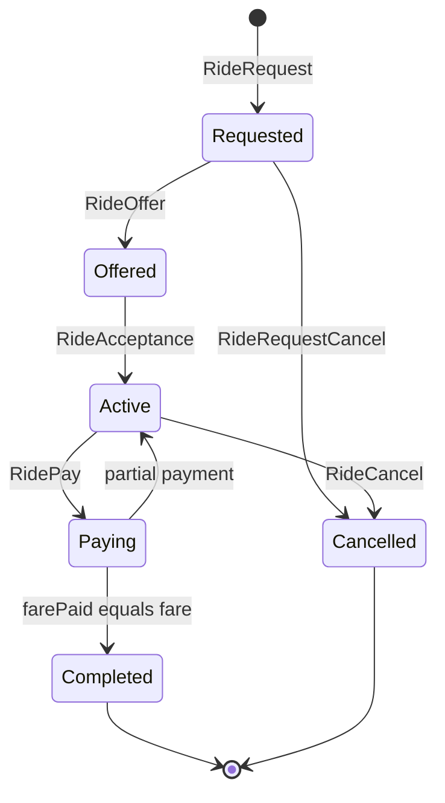

# Ride Lifecycle

This guide walks through the complete ride-sharing flow using the Clutch Hub SDK — from wallet setup to payment.

## Prerequisites

- Clutch stack running locally ([Quick Start](/getting-started/quickstart)) or use [Stage environment](/getting-started/environments)
- Two wallets: one passenger, one driver
- Test CLT via the [faucet](/clutch-hub-api/faucet)

## 1. Setup wallets and SDK

```javascript
import { ClutchHubSdk } from 'clutch-hub-sdk-js';

const API_URL = 'http://localhost:3000';

const passengerKey = '0x...'; // passenger public key
const driverKey = '0x...';    // driver public key
const passengerPrivateKey = '...'; // keep secret
const driverPrivateKey = '...';

const passengerSdk = new ClutchHubSdk(API_URL, passengerKey);
const driverSdk = new ClutchHubSdk(API_URL, driverKey);
```

## 2. Fund wallets

```javascript
await passengerSdk.requestFaucet(passengerKey);
await driverSdk.requestFaucet(driverKey);

const balance = await passengerSdk.getAccountBalance();
console.log('Passenger balance:', balance, 'CLT');
```

## 3. Passenger creates a ride request

```javascript
async function submitTx(sdk, unsigned, privateKey) {
  const signed = await sdk.signTransaction(unsigned, privateKey);
  await sdk.submitTransaction(signed.rawTransaction);
  return signed.txHash;
}

const requestTx = await submitTx(
  passengerSdk,
  await passengerSdk.createUnsignedRideRequest({
    pickup: { latitude: 35.6892, longitude: 51.3890 },
    dropoff: { latitude: 35.7219, longitude: 51.3347 },
    fare: 1000,
  }),
  passengerPrivateKey
);

console.log('Ride request tx:', requestTx);
```

## 4. Driver finds requests and submits an offer

```javascript
// Poll or subscribe
const requests = await driverSdk.listRideRequests();
console.log('Open requests:', requests);

const offerTx = await submitTx(
  driverSdk,
  await driverSdk.createUnsignedRideOffer({
    rideRequestTxHash: requestTx,
    fare: 1000,
  }),
  driverPrivateKey
);

console.log('Ride offer tx:', offerTx);
```

Real-time alternative:

```javascript
driverSdk.subscribeRideRequests(null, {
  onData: (requests) => console.log('Updated requests:', requests),
});
```

## 5. Passenger accepts the offer

```javascript
const offers = await passengerSdk.listRideOffers(requestTx);
const acceptanceTx = await submitTx(
  passengerSdk,
  await passengerSdk.createUnsignedRideAcceptance({
    rideOfferTxHash: offers[0].txHash,
  }),
  passengerPrivateKey
);

console.log('Acceptance tx:', acceptanceTx);
```

## 6. Passenger pays the driver

Partial payments are allowed until `farePaid` equals `fare`:

```javascript
await submitTx(
  passengerSdk,
  await passengerSdk.createUnsignedRidePay({
    rideAcceptanceTxHash: acceptanceTx,
    fare: 500, // first partial payment
  }),
  passengerPrivateKey
);

await submitTx(
  passengerSdk,
  await passengerSdk.createUnsignedRidePay({
    rideAcceptanceTxHash: acceptanceTx,
    fare: 500, // completes payment
  }),
  passengerPrivateKey
);
```

## 7. Monitor active trips

```javascript
passengerSdk.subscribeActiveTrips(
  { passengerAddress: passengerKey },
  {
    onData: (trips) => {
      trips.forEach((t) => {
        console.log(`Trip ${t.txHash}: paid ${t.farePaid}/${t.fare}`);
      });
    },
  }
);
```

When `farePaid === fare`, the trip moves to completed lists.

## Cancellation

**Cancel pending request** (passenger only, before acceptance):

```javascript
await submitTx(
  passengerSdk,
  await passengerSdk.createUnsignedRideRequestCancel({
    rideRequestTxHash: requestTx,
  }),
  passengerPrivateKey
);
```

**Cancel active trip** (either party, before full payment):

```javascript
await submitTx(
  passengerSdk,
  await passengerSdk.createUnsignedRideCancel({
    rideAcceptanceTxHash: acceptanceTx,
  }),
  passengerPrivateKey
);
```

## GraphQL equivalent

Each SDK method maps to a GraphQL mutation. Example for ride request:

```graphql
mutation CreateUnsignedRideRequest(
  $pickupLatitude: Float!, $pickupLongitude: Float!,
  $dropoffLatitude: Float!, $dropoffLongitude: Float!, $fare: Int!
) {
  createUnsignedRideRequest(
    pickupLatitude: $pickupLatitude,
    pickupLongitude: $pickupLongitude,
    dropoffLatitude: $dropoffLatitude,
    dropoffLongitude: $dropoffLongitude,
    fare: $fare
  )
}
```

Then sign client-side and call `sendRawTransaction`. See [GraphQL reference](/clutch-hub-api/graphql).

## State machine



## Next steps

- [Demo App user flows](/demo-app/user-flows) — see the reference React implementation
- [Transaction Flow](/reference/transaction-flow) — architecture overview
- [Signing spec](/reference/signing-and-encoding) — RLP and hash details
