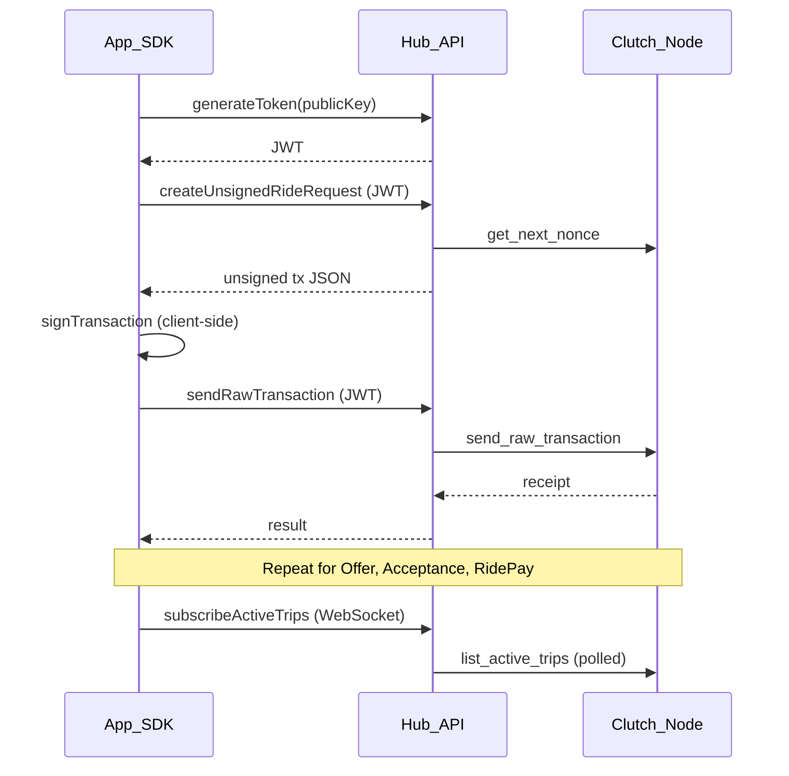

# Transaction Flow

## Full ride lifecycle

```
Passenger                          Driver
    │                                 │
    ├─ RideRequest ──────────────────►│ sees via list/subscribe
    │                                 ├─ RideOffer
    ├─ RideAcceptance ◄───────────────┤
    ├─ RidePay (partial OK) ────────►│ receives CLT
    │                                 │
    └─ completed when farePaid = fare
```

Cancellation paths:

- **Before acceptance:** passenger sends `RideRequestCancel` (references request tx hash)
- **After acceptance:** either party sends `RideCancel` (references acceptance tx hash) — only if fare not fully paid

## Per-transaction flow

Every write follows the same client-side signing pattern:

```
1. App calls SDK createUnsigned* (or GraphQL mutation)
2. API fetches nonce from node, builds unsigned JSON
3. SDK RLP-encodes and hashes unsigned payload
4. User signs hash with private key (client-side)
5. SDK builds signed RLP hex
6. SDK/API sendRawTransaction → node validates → block inclusion
7. Receipt returned to app
```

## Sequence diagram



## Data flow

```
App ──► SDK ──► Hub API ──► Clutch Node (WebSocket JSON-RPC)
         │           │
         │           └── GraphQL HTTP + /graphql/ws
         └── Client-side signing (private key stays local)
```

## Transaction hash linking

| Step | References |
|------|------------|
| RideOffer | `ride_request_transaction_hash` |
| RideAcceptance | `ride_offer_transaction_hash` |
| RidePay | `ride_acceptance_transaction_hash` |
| RideCancel | `ride_acceptance_transaction_hash` |
| RideRequestCancel | `ride_request_transaction_hash` |

Store each `txHash` returned after submission — the next step needs it.

## Read path

Queries and subscriptions do not require signing. The API polls the node and returns parsed ride lists. Subscriptions emit snapshots on an interval (~1s for trips, ~0.5s for offers).

## Related

- [Ride Lifecycle tutorial](/getting-started/ride-lifecycle)
- [Signing and Encoding](/reference/signing-and-encoding)
- [GraphQL reference](/clutch-hub-api/graphql)
